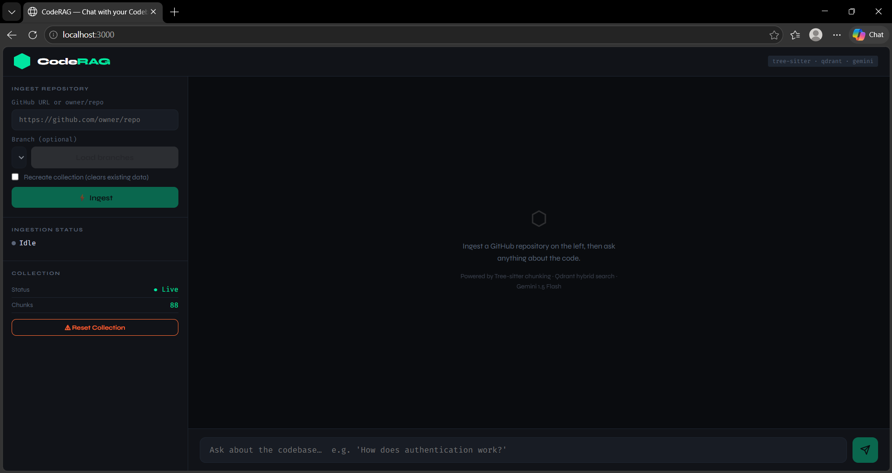
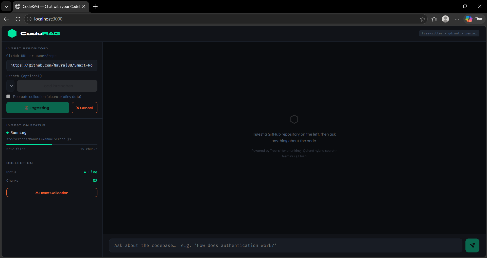
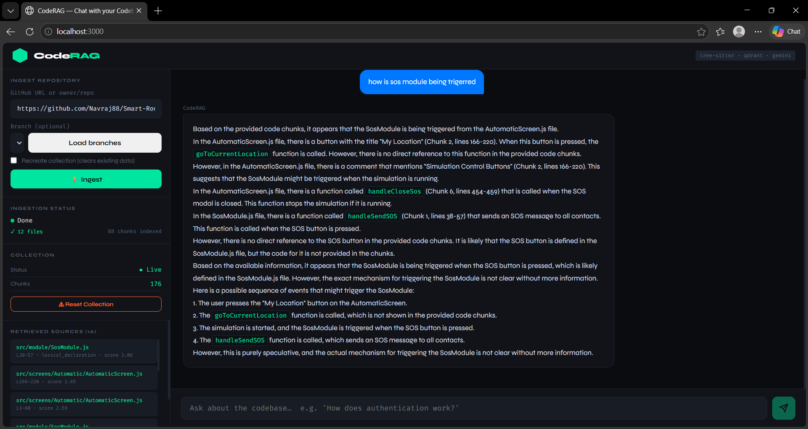

# RepoMind 🧠

A codebase-aware RAG system that understands repository structure and dependencies to deliver context-rich answers about your code.

## ✨ Features

- **Semantic Code Search** - Understand code intent, not just keywords
- **Multi-Language Support** - Python, JavaScript, TypeScript, Java, Go, Rust, C++, C#, Ruby, and more
- **Intelligent Chunking** - Smart code segmentation using Tree-sitter
- **Hybrid Search** - Combines dense + sparse retrieval for better results
- **Streaming Responses** - Real-time answer generation via SSE
- **Repository Context** - Understands dependencies and code relationships
- **No Node.js** - Lightweight vanilla JavaScript frontend with React CDN
- **Docker Ready** - One-command deployment

## 🛠️ Tech Stack

| Component | Technology | Usage |
|-----------|-----------|-------|
| **Backend** | FastAPI + Python 3.11 | API server & RAG logic (65.2%) |
| **Frontend** | Vanilla JavaScript + React CDN | Web UI (23.2%) |
| **Styling** | CSS3 | UI components (9.7%) |
| **Markup** | HTML5 | Page structure (1.4%) |
| **Vector DB** | Qdrant | Semantic search storage |
| **Embeddings** | Google Gemini | Code embeddings |
| **LLM** | Groq (Llama 3.1) | Answer generation |
| **Code Analysis** | Tree-sitter | AST-based parsing |
| **DevOps** | Docker & Docker Compose | Containerization (0.5%) |

## 📁 Project Structure

```
RepoMind/
├── backend/                    # FastAPI backend
│   ├── main.py                # API endpoints & server
│   ├── config.py              # Configuration & env vars
│   ├── ingestion/             # Repository ingestion pipeline
│   │   ├── github_fetcher.py  # Clone & fetch repos
│   │   ├── tree_sitter_chunker.py  # Code chunking
│   │   └── embedder.py        # Generate embeddings
│   ├── retrieval/             # Search & retrieval
│   │   ├── qdrant_store.py    # Vector storage
│   │   ├── hybrid_search.py   # Semantic search
│   │   └── code_graph.py      # Dependency tracking
│   └── chat/                  # LLM integration
│       └── chat_provider.py   # Streaming responses
├── frontend/                   # Web UI
│   ├── index.html             # Main HTML
│   ├── js/                    # Vanilla JS + React
│   │   ├── App.js             # Root component
│   │   ├── config.js          # API configuration
│   │   ├── utils.js           # Helper functions
│   │   └── components/        # React components
│   │       ├── Header.js
│   │       ├── IngestPanel.js
│   │       ├── CollectionPanel.js
│   │       ├── SourcesPanel.js
│   │       └── ChatArea.js
│   └── styles/                # CSS styling
│       └── main.css
├── assets/                    # Images & diagrams
│   ├── startup.png            # System startup flow
│   ├── repo-ingestion.png     # Ingestion pipeline
│   └── query-ans.png          # Query-answer flow
├── Dockerfile                 # Container configuration
├── docker-compose.yml         # Multi-service orchestration
├── requirements.txt           # Python dependencies
└── README.md                  # This file

```

## 🚀 Quick Start

### Option 1: Docker Compose (Recommended)

#### Prerequisites
- Docker & Docker Compose installed
- `.env` file with API keys (see below)

#### Steps

```bash
# 1. Clone the repository
git clone https://github.com/Navraj88/RepoMind.git
cd RepoMind

# 2. Create .env file with your API keys
cat > .env << EOF
GEMINI_API_KEY=your_gemini_key_here
GROQ_API_KEY=your_groq_key_here
GITHUB_TOKEN=your_github_token_here
QDRANT_HOST=qdrant
QDRANT_PORT=6333
EOF

# 3. Start all services
docker-compose up --build

# 4. Access the application
# Frontend: http://localhost:8000/frontend
# API Docs: http://localhost:8000/docs
# Qdrant Dashboard: http://localhost:6333/dashboard
```

### Option 2: Local Development

#### Prerequisites
- Python 3.11+
- Docker (for Qdrant) OR remote Qdrant instance

#### Steps

```bash
# 1. Clone the repository
git clone https://github.com/Navraj88/RepoMind.git
cd RepoMind

# 2. Create virtual environment
python -m venv venv
source venv/bin/activate  # On Windows: venv\Scripts\activate

# 3. Install dependencies
pip install -r requirements.txt

# 4. Create .env file
cat > .env << EOF
GEMINI_API_KEY=your_gemini_key_here
GROQ_API_KEY=your_groq_key_here
GITHUB_TOKEN=your_github_token_here
QDRANT_HOST=localhost
QDRANT_PORT=6333
EOF

# 5. Start Qdrant (using Docker)
docker run -p 6333:6333 -p 6334:6334 qdrant/qdrant:v1.9.2

# 6. Start backend server
cd backend
uvicorn main:app --reload --port 8000

# 7. Open frontend
# Navigate to http://localhost:8000 in your browser
# Serve static files: python -m http.server 8000 --directory ../frontend
```

## 📊 Workflow Diagrams

### 1. System Startup Flow



System initialization, Qdrant connection, and service readiness checks.

### 2. Repository Ingestion Pipeline



Complete code ingestion workflow from GitHub clone to vector storage.

### 3. Query & Answer Generation



End-to-end process from user question to LLM-generated answer with source citations.

## 📡 API Endpoints

### Health Check
```bash
curl http://localhost:8000/health
```
**Response:** `{"status": "ok"}`

---

### Collection Info
```bash
curl http://localhost:8000/collection/info
```
**Response:**
```json
{
  "collection": "codebase_chunks",
  "exists": true,
  "chunk_count": 1250
}
```

---

### Reset Collection
```bash
curl -X POST http://localhost:8000/collection/reset
```
**Response:** `{"message": "Collection reset successfully"}`

---

### Ingest Repository
```bash
curl -X POST http://localhost:8000/ingest \
  -H "Content-Type: application/json" \
  -d '{
    "repo_url": "https://github.com/facebook/react",
    "branch": "main",
    "recreate_collection": false
  }'
```
**Response:**
```json
{
  "message": "Ingestion started",
  "repo_url": "https://github.com/facebook/react",
  "branch": "main"
}
```

---

### Get Ingestion Status (SSE Stream)
```bash
curl http://localhost:8000/ingest/status
```
**Streams:**
```json
{"status": "running", "processed_files": 15, "total_files": 450, "total_chunks": 3420}
{"status": "done", "processed_files": 450, "total_chunks": 12350}
```

---

### Cancel Ingestion
```bash
curl -X POST http://localhost:8000/ingest/cancel
```
**Response:** `{"message": "Cancel signal sent. Stopping after current file."}`

---

### Chat with Codebase (SSE Stream)
```bash
curl -X POST http://localhost:8000/chat \
  -H "Content-Type: application/json" \
  -d '{
    "query": "How does the useEffect hook work?",
    "top_k": 8,
    "filter_lang": "javascript"
  }'
```
**Streams:**
```json
{"type": "sources", "data": [...]}
{"type": "token", "data": "The"}
{"type": "token", "data": " useEffect"}
{"type": "done"}
```

---

### List Repository Branches
```bash
curl "http://localhost:8000/ingest/branches?repo_url=facebook/react"
```
**Response:**
```json
{
  "repo_url": "facebook/react",
  "branches": ["main", "dev", "next"]
}
```

---

### Graph Information
```bash
curl http://localhost:8000/graph/info
```
**Response:**
```json
{
  "nodes": 450,
  "edges": 1250,
  "modules": 85
}
```

## 🔐 Environment Variables

Create a `.env` file in the project root:

```env
# Gemini API (for embeddings & chat)
GEMINI_API_KEY=your_gemini_api_key

# Groq API (for LLM chat)
GROQ_API_KEY=your_gro...
```

### How to Get API Keys

**Gemini API:**
1. Go to [Google AI Studio](https://aistudio.google.com/apikey)
2. Click "Create API Key"
3. Copy and paste into `.env`

**Groq API:**
1. Visit [Groq Console](https://console.groq.com)
2. Create account and generate API key
3. Add to `.env`

**GitHub Token:**
1. Go to GitHub Settings → Developer settings → Personal access tokens
2. Click "Generate new token (classic)"
3. Select `repo` scope
4. Copy token to `.env`

## ⚙️ Configuration

Edit `backend/config.py` to customize:

```python
# Chunking
MAX_CHUNK_LINES = 60       # Max lines per chunk
MIN_CHUNK_LINES = 5        # Min lines per chunk
CHUNK_OVERLAP_LINES = 5    # Overlap for context

# Hybrid Search
DENSE_WEIGHT = 0.7         # Weight for semantic search
SPARSE_WEIGHT = 0.3        # Weight for keyword search
TOP_K = 8                  # Results per query

# Supported Languages
.py, .js, .ts, .jsx, .tsx, .java, .go, .rs, .cpp, .c, .cs, .rb, .md
```

## 🐛 Troubleshooting

### Qdrant Connection Failed
```
Error: Failed to connect to Qdrant at localhost:6333
```
**Solution:**
- Ensure Qdrant is running: `docker ps | grep qdrant`
- Check `QDRANT_HOST` and `QDRANT_PORT` in `.env`
- Restart Qdrant: `docker-compose down && docker-compose up`

---

### API Key Errors
```
Error: Invalid API key or unauthorized
```
**Solution:**
- Verify keys in `.env` are correct
- Check API key quotas/limits in respective dashboards
- Ensure keys have required permissions

---

### Out of Memory During Ingestion
```
Error: Killed or OOM while processing large repository
```
**Solution:**
- Reduce `MAX_CHUNK_LINES` in `config.py`
- Ingest specific branches instead of full repo
- Run on machine with more RAM

---

### Slow Search Results
```
Query takes >5 seconds to process
```
**Solution:**
- Increase `TOP_K` retrieval limit
- Adjust `DENSE_WEIGHT` and `SPARSE_WEIGHT`
- Add more compute resources to Qdrant

---

### Frontend Not Loading
```
http://localhost:8000 returns 404
```
**Solution:**
- Ensure backend is running on port 8000
- Check that frontend files are served correctly
- Verify CORS is enabled in `main.py`

## 📚 Supported Languages

RepoMind can analyze and chunk code in:

- Python (.py)
- JavaScript (.js, .jsx)
- TypeScript (.ts, .tsx)
- Java (.java)
- Go (.go)
- Rust (.rs)
- C++ (.cpp)
- C (.c)
- C# (.cs)
- Ruby (.rb)
- Markdown (.md)
- Plus many more via Tree-sitter

## 🧪 Testing

### Health Check
```bash
curl http://localhost:8000/health
# Expected: {"status": "ok"}
```

### Ingestion Test
```bash
curl -X POST http://localhost:8000/ingest \
  -H "Content-Type: application/json" \
  -d '{"repo_url": "torvalds/linux", "recreate_collection": true}'
```

### Chat Test
```bash
curl -X POST http://localhost:8000/chat \
  -H "Content-Type: application/json" \
  -d '{"query": "What does this code do?"}'
```

## 🤝 Contributing

Contributions are welcome! Please:

1. Fork the repository
2. Create a feature branch: `git checkout -b feature/your-feature`
3. Commit changes: `git commit -m "Add your feature"`
4. Push to branch: `git push origin feature/your-feature`
5. Open a Pull Request

## 📝 License

This project is open source and available under the MIT License.

## 🙋 Support

For issues, questions, or suggestions:

- Open an [Issue](https://github.com/Navraj88/RepoMind/issues)
- Check existing documentation
- Review API docs at "/docs" endpoint

---

**RepoMind** - Understand your codebase, ask better questions.